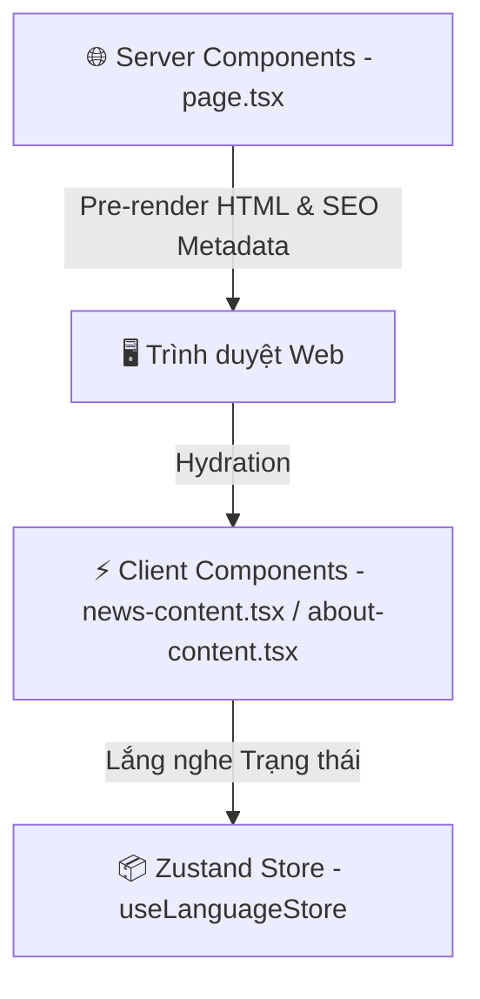

# 🏗️ System Overview - Kiến trúc Frontend Next.js 15 App Router

Tài liệu này đặc tả chi tiết kiến trúc lập trình, phân tách thành phần Server/Client, cơ chế quản lý trạng thái và mô hình kiểu dữ liệu khép kín áp dụng tại phân hệ Frontend của Điện Máy Trần Điền.

## 🗺️ Bản đồ Kiến trúc Định tuyến tĩnh & Separating Components

Dự án tận dụng kiến trúc **Next.js 15 App Router** tối ưu lai ghép giữa kết xuất tĩnh phía máy chủ (React Server Components - RSC) và xử lý tương tác phía máy khách (Client Components).



### 1. React Server Components (RSC - page.tsx)
Mặc định các tệp định tuyến chính như `src/app/page.tsx`, `src/app/about/page.tsx`, `src/app/news/page.tsx`, `src/app/projects/page.tsx` là Server Components.
*   **Ưu điểm**: Kết xuất tĩnh 100% tại thời điểm Build-time ngay trên máy chủ (Static Site Generation - SSG). Cải thiện tốc độ tải trang ban đầu vượt bậc (FCP < 0.5s) và tối ưu điểm SEO tuyệt đối.
*   **Nhiệm vụ**: Khai báo Metadata tĩnh/động, tiêm dữ liệu cấu trúc JSON-LD Schema và bọc các Client Component bên trong.

### 2. Client Components (`"use client"`)
Các thành phần tương tác cao như bộ tìm kiếm, bộ lọc danh mục, preloader, và hiệu ứng GSAP/Framer Motion được khai báo `"use client"`.
*   **Ví dụ**: `about-content.tsx`, `news-content.tsx`, `projects-gallery.tsx`.
*   **Nhiệm vụ**: Thực hiện hydration kích hoạt tương tác, quản lý state và tương tác trực tiếp với API trình duyệt.

---

## 📦 Quản lý Trạng thái Toàn cục bằng Zustand (State Management)

Zustand được sử dụng làm giải pháp lưu trữ trạng thái siêu nhẹ, đồng bộ tức thời trên toàn bộ cây component mà không gây tải lại trang hay giật lag.

### 1. Đồng bộ trạng thái song ngữ (`useLanguageStore.ts`)
*   Lưu trữ ngôn ngữ hoạt động (`"vi"` hoặc `"en"`).
*   Đọc và lưu trạng thái vào `localStorage` của trình duyệt.
*   **Hydration-Safe**: Để tránh lỗi mất đồng bộ Hydration (mismatch giữa Server và Client) của Next.js App Router, mặc định lúc khởi chạy ứng dụng từ máy chủ, `lang` luôn được thiết lập là `"vi"`. Ngay sau khi trang được mount thành công trên máy khách (Client-side mount), thành phần `ScrollReset` sẽ tự động đọc `localStorage.getItem("lang")` và cập nhật trực tiếp vào Zustand Store `useLanguageStore.setState({ lang: saved })` mà không cần kích hoạt tải lại trang thêm lần nào nữa.

### 2. Đồng bộ trạng thái tải trang (`use-app-store.ts`)
*   Quản lý biến trạng thái Preloader `isLoaded` (hoàn thành hay đang chạy).
*   Chặn hiện tượng nhấp nháy giao diện thô chưa định dạng (FOUC Protection) bằng cách ép ẩn các phần tử qua GSAP trước khi màn chờ biến mất.

---

## 🎯 Định kiểu dữ liệu TypeScript Khép kín (Strict Type Safety)

Toàn bộ mô hình dữ liệu trong dự án (sản phẩm, dự án, tin tức) được kiểm soát nghiêm ngặt bằng TypeScript Interfaces và Literal Types nhằm triệt tiêu lỗi runtime:

```typescript
export interface Project {
  id: number;
  slug: string;
  src: string;
  title: string;
  titleEn: string;
  category: "commercial" | "residential" | "maintenance"; // Literal Types ràng buộc chặt chẽ
  categoryName: string;
  categoryNameEn: string;
  description: string;
  descriptionEn: string;
  client: string;
  clientEn: string;
  location: string;
  locationEn: string;
  date: string;
  specs: string[];
  specsEn: string[];
}
```
